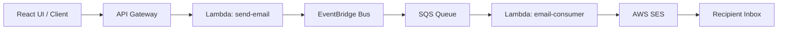

# 📧 Email Service (AWS + SST)

A full-stack, event-driven email delivery system built with AWS and SST.
It exposes an HTTP API and a React UI, processes requests asynchronously, and delivers emails using AWS SES.

---

## 🚀 Live Demo

* **Frontend:** `<WEB_URL>`
* **API:** `<API_URL>`

> Replace with your deployed URLs from `sst deploy`

---

## 🧠 Architecture



---

## ⚙️ How it works

1. User submits the form via the React UI
2. API Gateway triggers a Lambda (`send-email`)
3. The Lambda validates the payload and publishes an event
4. EventBridge routes the event to an SQS queue
5. A consumer Lambda processes the queue message
6. The email is sent via AWS SES

---

## 🧰 Tech Stack

### Backend

* TypeScript
* SST (Serverless Stack)
* AWS Lambda
* API Gateway
* EventBridge
* SQS
* SES
* Zod (validation)

### Frontend

* React (Vite)
* TypeScript

### Testing

* Vitest

---

## 📦 Project Structure

```txt
email-service/
├── src/              # Backend (Lambdas)
│   ├── api/
│   ├── workers/
│   └── lib/
├── web/              # Frontend (React app)
├── test/             # Tests
├── sst.config.ts     # Infrastructure
├── package.json      # Backend dependencies
└── README.md
```

---

## 🔌 API

### Endpoint

```
POST /send-email
```

### Request body

```json
{
  "toEmail": "example@gmail.com",
  "subject": "Hello",
  "message": "This is a test email"
}
```

### Response

```json
{
  "message": "Accepted"
}
```

---

## 🖥️ Frontend

A simple React UI allows users to:

* enter recipient email
* enter subject and message
* submit requests asynchronously

The UI calls the backend API using `fetch`.

---

## ⚙️ Setup

### 1. Install dependencies

```bash
npm install
cd web && npm install
```

---

### 2. Configure AWS

```bash
aws configure --profile personal
```

---

### 3. Deploy

```bash
AWS_PROFILE=personal npx sst deploy
```

---

## 🧪 Running locally

### Backend (dev mode)

```bash
AWS_PROFILE=personal npx sst dev
```

### Frontend

```bash
cd web
npm run dev
```

---

## 📬 SES Configuration

AWS SES starts in **sandbox mode**, which requires:

* verifying the sender email
* verifying the recipient email

### Steps:

1. Go to **SES → Identities**
2. Create identity (Email address)
3. Verify via email link

> In sandbox mode, both sender and recipient must be verified.

---

## 🧪 Testing

Run tests:

```bash
npm test
```

Includes:

* API validation tests
* SQS consumer behavior tests
* SES interaction mocking

---

## 🧠 Design Decisions

### Event-driven architecture

Decouples API from processing:

* scalable
* fault-tolerant
* extensible

### Asynchronous processing

API responds immediately (`202 Accepted`), improving responsiveness.

### SQS queue

Ensures:

* retries
* durability
* message buffering

---

## ⚠️ Limitations

* SES sandbox restrictions (verified emails only)
* No authentication on API
* Minimal UI validation
* No monitoring dashboard

---

## 🔮 Improvements

* Move SES out of sandbox
* Add authentication (JWT/API key)
* Add DLQ visibility
* Add metrics/alerts (CloudWatch)
* Add integration tests
* Improve UI/UX

---

## 🚀 Deployment

Frontend is deployed using SST `StaticSite`:

* built with Vite
* hosted via AWS (CloudFront)

Backend deployed with SST infrastructure.

---

## ✅ Status

✔ Backend architecture complete
✔ Frontend integrated
✔ End-to-end flow working
✔ Email delivery verified

---

## 👩‍💻 Author

Cristina Guimarães

